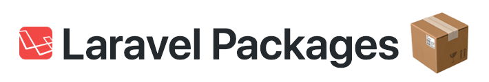
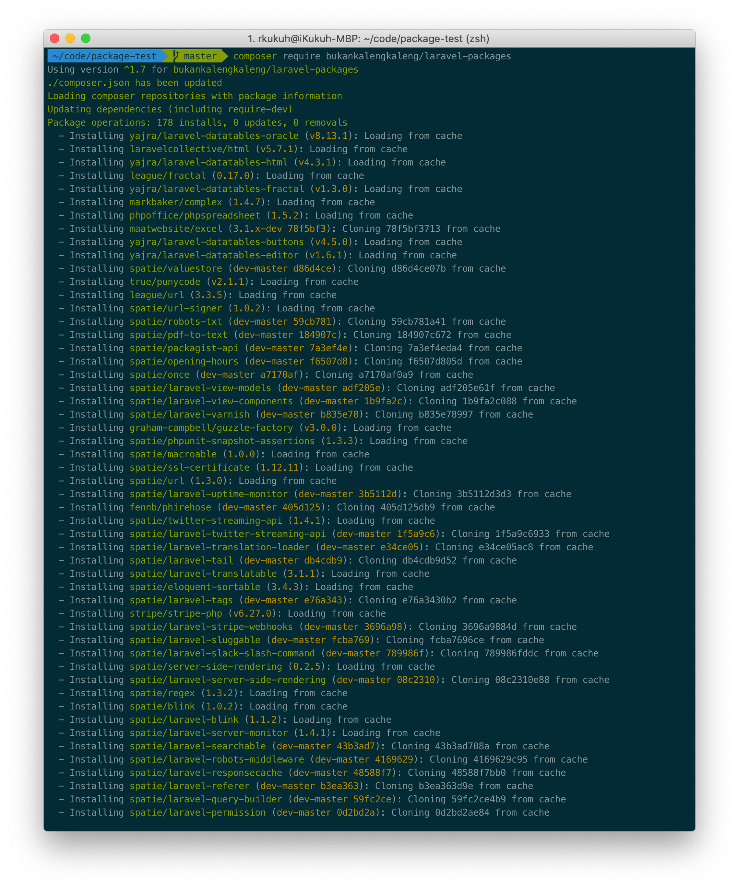
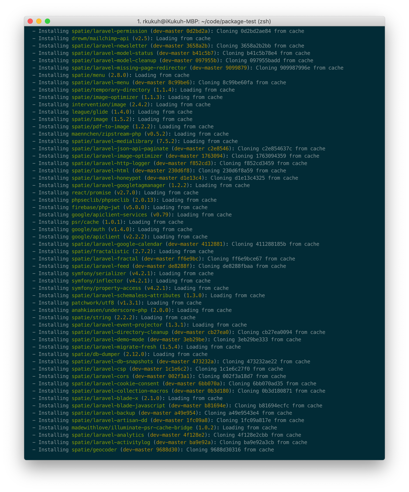
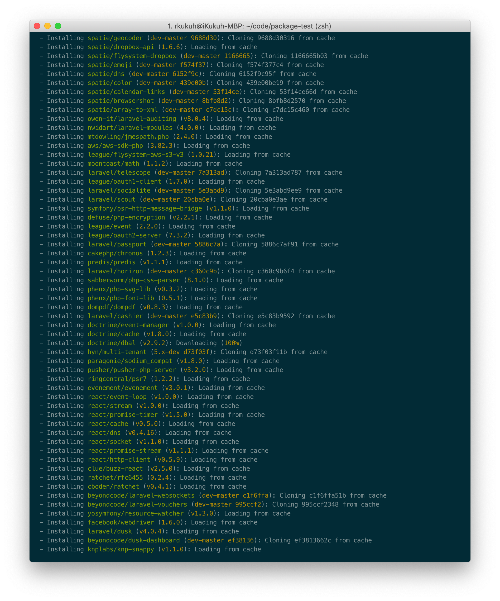
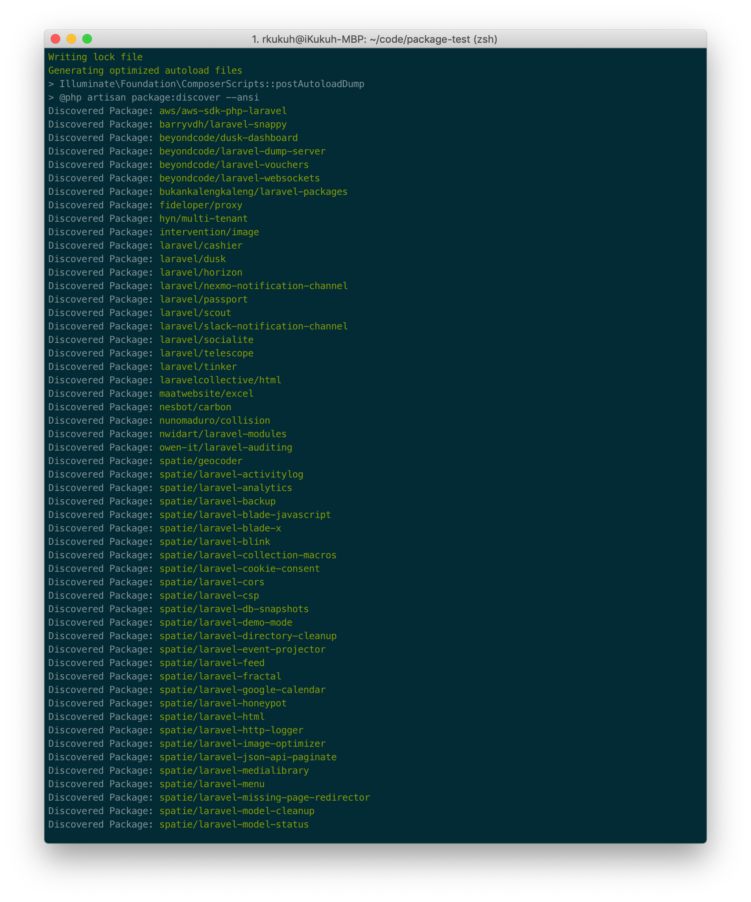
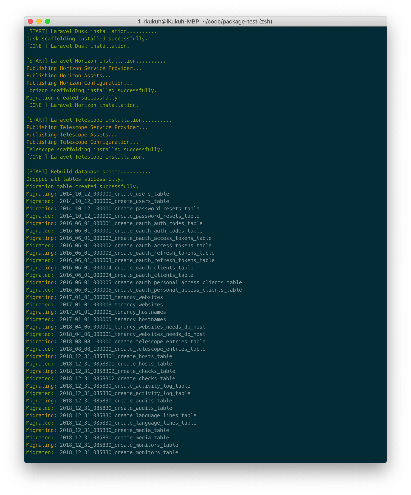

<p align="center"></p>

<p align="center">This readme is written in Bahasa. <a href="https://github.com/bukankalengkaleng/laravel-packages/blob/master/README.EN.md">English version is here</a></p>

---

| Development | Code Quality | Versions | Statistics | About |
| :---------: | :----------: | :------: | :--------: | :---: |
| [](https://travis-ci.org/bukankalengkaleng/laravel-packages) <br> [](https://codeclimate.com/github/bukankalengkaleng/laravel-packages/maintainability) <br> [](https://codeclimate.com/github/bukankalengkaleng/laravel-packages/test_coverage) | [](https://scrutinizer-ci.com/g/bukankalengkaleng/laravel-packages/?branch=master) <br> [](https://codecov.io/gh/bukankalengkaleng/laravel-packages) <br> [](https://scrutinizer-ci.com/code-intelligence) | [](https://packagist.org/packages/bukankalengkaleng/laravel-packages) <br> [](https://packagist.org/packages/bukankalengkaleng/laravel-packages) | [](https://packagist.org/packages/bukankalengkaleng/laravel-packages) | [](https://packagist.org/packages/bukankalengkaleng/laravel-packages)

## Deskripsi

Kumpulan packages Laravel terbaik, pilihan pribadi.

## Motivasi

Package ini saya buat agar saya (atau kalian) tak perlu lagi bersusah-payah memasukkann satu-per-satu packages favorit kesuatu proyek.

## Instalasi

1. Instal fresh Laravel
1. Tambahkan kode berikut dalam file `config/database.php`, bagian `connections`:
    ```php
    'system' => [
        'driver' => 'mysql',
        'host' => env('TENANCY_HOST', '127.0.0.1'),
        'port' => env('TENANCY_PORT', '3306'),
        'database' => env('TENANCY_DATABASE', 'tenancy'),
        'username' => env('TENANCY_USERNAME', 'tenancy'),
        'password' => env('TENANCY_PASSWORD', ''),
        'unix_socket' => env('DB_SOCKET', ''),
        'charset' => 'utf8mb4',
        'collation' => 'utf8mb4_unicode_ci',
        'prefix' => '',
        'strict' => true,
        'engine' => null,
    ]
    ```
    > Kode diatas dibutuhkan oleh package **Multi-Tenant**. Dokumentasi resminya [disini](https://laravel-tenancy.com/docs/hyn/5.3/installation).
1. Setup database (konfigurasi juga file `.env`)
1. Jalankan perintah:
    ```
    composer require bukankalengkaleng/laravel-packages
    ```
1. Jalankan perintah:
    ```
    php artisan laravel-packages:install
    ```

## Daftar Packages

Berikut adalah daftar packages yang tersedia saat ini (urut A-Z):

### Main packages

1. [Algolia's PHP SDK](https://github.com/algolia/algoliasearch-client-php)
1. [AWS' Laravel PHP SDK](https://github.com/aws/aws-sdk-php-laravel)
1. [BeyondCode's Dusk Dashboard](https://github.com/beyondcode/dusk-dashboard)
1. [BeyondCode's Laravel Vouchers](https://github.com/beyondcode/laravel-vouchers)
1. [BeyondCode's Laravel Websockets](https://docs.beyondco.de/laravel-websockets/)
1. [Hyn's Multi-Tenant](https://github.com/hyn/multi-tenant)
1. [Laravel Cashier](https://laravel.com/docs/5.7/billing)
1. [Laravel Dusk](https://laravel.com/docs/5.7/dusk)
1. [Laravel Horizon](https://laravel.com/docs/5.7/horizon)
1. [Laravel Passport](https://laravel.com/docs/5.7/passport)
1. [Laravel Scout](https://laravel.com/docs/5.7/scout)
1. [Laravel Socialite](https://laravel.com/docs/5.7/socialite)
1. [Laravel Telescope](https://laravel.com/docs/5.7/telescope)
1. [League's Flysystem AWS S3](https://github.com/thephpleague/flysystem-aws-s3-v3)
1. [Maatwebsite's Laravel Excel](https://github.com/maatwebsite/Laravel-Excel)
1. [nWidart's Laravel Modules](https://github.com/nWidart/laravel-modules)
1. [Owen-IT's Laravel Auditing](https://github.com/owen-it/laravel-auditing)
1. [Spatie's Array-to-XML](https://github.com/spatie/array-to-xml)
1. [Spatie's Browsershot](https://github.com/spatie/browsershot)
1. [Spatie's Calendar Links](https://github.com/spatie/calendar-links)
1. [Spatie's Color](https://github.com/spatie/color)
1. [Spatie's DNS](https://github.com/spatie/dns)
1. [Spatie's Dropbox API](https://github.com/spatie/dropbox-api)
1. [Spatie's Eloquent Sortable](https://github.com/spatie/eloquent-sortable)
1. [Spatie's Emoji](https://github.com/spatie/emoji)
1. [Spatie's Flysystem Dropbox](https://github.com/spatie/flysystem-dropbox)
1. [Spatie's Geocoder](https://github.com/spatie/geocoder)
1. [Spatie's Image](https://github.com/spatie/image)
1. [Spatie's Laravel Activitylog](https://github.com/spatie/laravel-activitylog)
1. [Spatie's Laravel Analytics](https://github.com/spatie/laravel-analytics)
1. [Spatie's Laravel Artisan DD](https://github.com/spatie/laravel-artisan-dd)
1. [Spatie's Laravel Backup](https://github.com/spatie/laravel-backup)
1. [Spatie's Laravel Blade-Javascript](https://github.com/spatie/laravel-blade-javascript)
1. [Spatie's Laravel Blade X](https://github.com/spatie/laravel-blade-x)
1. [Spatie's Laravel Blink](https://github.com/spatie/laravel-blink)
1. [Spatie's Laravel Collection Macros](https://github.com/spatie/laravel-collection-macros)
1. [Spatie's Laravel Cookie Consent](https://github.com/spatie/laravel-cookie-consent)
1. [Spatie's Laravel CORS](https://github.com/spatie/laravel-cors)
1. [Spatie's Laravel CSP](https://github.com/spatie/laravel-csp)
1. [Spatie's Laravel DB Snapshots](https://github.com/spatie/laravel-db-snapshots)
1. [Spatie's Laravel Demo Mode](https://github.com/spatie/laravel-demo-mode)
1. [Spatie's Laravel Directory CleanUp](https://github.com/spatie/laravel-directory-cleanup)
1. [Spatie's Laravel Event Projector](https://github.com/spatie/laravel-event-projector)
1. [Spatie's Laravel Feed](https://github.com/spatie/laravel-feed)
1. [Spatie's Laravel Fractal](https://github.com/spatie/laravel-fractal)
1. [Spatie's Laravel Google Calendar](https://github.com/spatie/laravel-google-calendar)
1. [Spatie's Laravel Google Tag Manager](https://github.com/spatie/laravel-googletagmanager)
1. [Spatie's Laravel Honeypot](https://github.com/spatie/laravel-honeypot)
1. [Spatie's Laravel HTML](https://github.com/spatie/laravel-html)
1. [Spatie's Laravel HTTP Logger](https://github.com/spatie/laravel-http-logger)
1. [Spatie's Laravel Image Optimizer](https://github.com/spatie/laravel-image-optimizer)
1. [Spatie's Laravel JSON API Paginate](https://github.com/spatie/laravel-json-api-paginate)
1. [Spatie's Laravel Menu](https://github.com/spatie/laravel-menu)
1. [Spatie's Laravel Medialibrary](https://github.com/spatie/laravel-medialibrary)
1. [Spatie's Laravel Missing Page Redirector](https://github.com/spatie/laravel-missing-page-redirector)
1. [Spatie's Laravel Model CleanUp](https://github.com/spatie/laravel-model-cleanup)
1. [Spatie's Laravel Model Status](https://github.com/spatie/laravel-model-status)
1. [Spatie's Laravel Newsletter](https://github.com/spatie/laravel-newsletter)
1. [Spatie's Laravel Permission](https://github.com/spatie/laravel-permission)
1. [Spatie's Laravel Query Builder](https://github.com/spatie/laravel-query-builder)
1. [Spatie's Laravel Response Cache](https://github.com/spatie/laravel-responsecache)
1. [Spatie's Laravel Referer](https://github.com/spatie/laravel-referer)
1. [Spatie's Laravel Robots Middleware](https://github.com/spatie/laravel-robots-middleware)
1. [Spatie's Laravel Robots-txt](https://github.com/spatie/robots-txt)
1. [Spatie's Laravel Schemaless Attributes](https://github.com/spatie/laravel-schemaless-attributes)
1. [Spatie's Laravel Searchable](https://github.com/spatie/laravel-searchable)
1. [Spatie's Laravel Server Monitor](https://github.com/spatie/laravel-server-monitor)
1. [Spatie's Laravel Server-Side Rendering](https://github.com/spatie/laravel-server-side-rendering)
1. [Spatie's Laravel Slack Slash Command](https://github.com/spatie/laravel-slack-slash-command)
1. [Spatie's Laravel Sluggable](https://github.com/spatie/laravel-sluggable)
1. [Spatie's Laravel Stripe Webhooks](https://github.com/spatie/laravel-stripe-webhooks)
1. [Spatie's Laravel Tags](https://github.com/spatie/laravel-tags)
1. [Spatie's Laravel Tail](https://github.com/spatie/laravel-tail)
1. [Spatie's Laravel Translatable](https://github.com/spatie/laravel-translatable)
1. [Spatie's Laravel Translation Loader](https://github.com/spatie/laravel-translation-loader)
1. [Spatie's Laravel Twitter Streaming API](https://github.com/spatie/twitter-streaming-api)
1. [Spatie's Laravel Uptime Monitor](https://github.com/spatie/laravel-uptime-monitor)
1. [Spatie's Laravel Varnish](https://github.com/spatie/laravel-varnish)
1. [Spatie's Laravel View-Components](https://github.com/spatie/laravel-view-components)
1. [Spatie's Laravel View-Models](https://github.com/spatie/laravel-view-models)
1. [Spatie's Macroable](https://github.com/spatie/macroable)
1. [Spatie's Once](https://github.com/spatie/once)
1. [Spatie's Opening Hours](https://github.com/spatie/opening-hours)
1. [Spatie's Packagist API](https://github.com/spatie/packagist-api)
1. [Spatie's PDF-to-Image](https://github.com/spatie/pdf-to-image)
1. [Spatie's PDF-to-Text](https://github.com/spatie/pdf-to-text)
1. [Spatie's Regex](https://github.com/spatie/regex)
1. [Spatie's SSL Certificate](https://github.com/spatie/ssl-certificate)
1. [Spatie's Temporary Directory](https://github.com/spatie/temporary-directory)
1. [Spatie's URL](https://github.com/spatie/url)
1. [Spatie's URL Signer](https://github.com/spatie/url-signer)
1. [Spatie's Value Store](https://github.com/spatie/valuestore)
1. [Yajra's DataTables](https://github.com/yajra/laravel-datatables)

### Main package's plugins / libraries

1. [AWS' PHP SNS Message Validator](https://github.com/aws/aws-php-sns-message-validator)
1. [Barryvdh's Laravel Snappy](https://github.com/barryvdh/laravel-snappy)
1. [Doctrine's DBAL](https://www.doctrine-project.org/projects/dbal.html)
1. [Yajra's DataTables Editor](https://github.com/yajra/laravel-datatables-editor)
1. [Yajra's DataTables HTML](https://github.com/yajra/laravel-datatables-html)
1. [Yajra's DataTables Button](https://github.com/yajra/laravel-datatables-buttons)
1. [Yajra's DataTables Fractal](https://github.com/yajra/laravel-datatables-fractal)

## Screenshots

    

## Roadmap

Bagaimana dengan packages yang tidak ada dalam daftar di atas? Silahkan lihat dalam [Roadmap](https://github.com/bukankalengkaleng/laravel-packages/blob/master/ROADMAP.md) ini.

## Kontribusi [](https://github.com/engkaleng/laravel-packages/issues)

Punya packages favorit yang belum ada disini?

1. Kirim PR
1. Gak perlu baper kalo PR tertolak

## Catatan Revisi

Catatan revisi dapat dilihat di [Changelog](https://github.com/bukankalengkaleng/laravel-packages/blob/master/CHANGELOG.md) ini.

## Lisensi

Lisensi dari package ini adalah MIT License (MIT). Silahkan lihat bagian [Lisensi](https://github.com/bukankalengkaleng/laravel-packages/blob/master/LICENSE.md) ini untuk lebih jelasnya.
